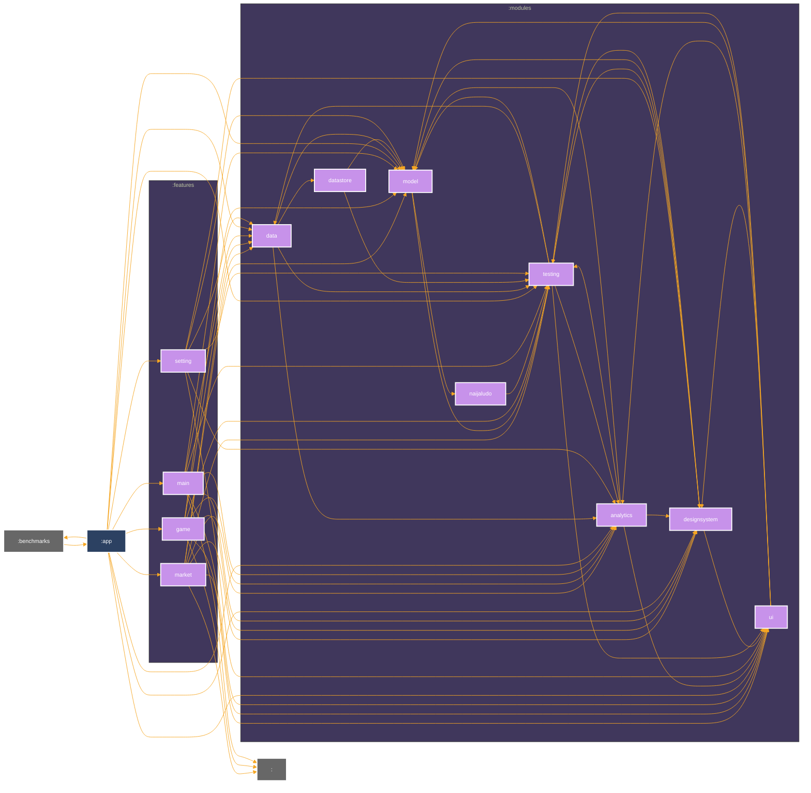

###  Naijaludo Module Graph

```mermaid
%%{
  init: {
    'theme': 'base',
    'themeVariables': {"primaryTextColor":"#fff","primaryColor":"#5a4f7c","primaryBorderColor":"#5a4f7c","lineColor":"#f5a623","tertiaryColor":"#40375c","fontSize":"12px"}
  }
}%%

graph LR
  subgraph :features
    :features:market["market"]
    :features:game["game"]
    :features:main["main"]
    :features:setting["setting"]
  end
  subgraph :modules
    :modules:data["data"]
    :modules:model["model"]
    :modules:ui["ui"]
    :modules:designsystem["designsystem"]
    :modules:analytics["analytics"]
    :modules:testing["testing"]
    :modules:naijaludo["naijaludo"]
    :modules:datastore["datastore"]
  end
  :features:market --> :modules:data
  :features:market --> :modules:model
  :features:market --> :modules:ui
  :features:market --> :modules:designsystem
  :features:market --> :modules:analytics
  :features:market --> :
  :features:market --> :modules:testing
  :modules:model --> :modules:naijaludo
  :modules:model --> :modules:testing
  :features:game --> :modules:data
  :features:game --> :modules:model
  :features:game --> :modules:ui
  :features:game --> :modules:designsystem
  :features:game --> :modules:analytics
  :features:game --> :
  :features:game --> :modules:testing
  :benchmarks --> :app
  :modules:naijaludo --> :modules:testing
  :features:main --> :
  :features:main --> :modules:data
  :features:main --> :modules:model
  :features:main --> :modules:ui
  :features:main --> :modules:designsystem
  :features:main --> :modules:analytics
  :features:main --> :modules:testing
  :app --> :modules:testing
  :app --> :benchmarks
  :app --> :modules:designsystem
  :app --> :modules:data
  :app --> :modules:ui
  :app --> :modules:model
  :app --> :modules:analytics
  :app --> :features:main
  :app --> :features:game
  :app --> :features:setting
  :app --> :features:market
  :modules:data --> :modules:datastore
  :modules:data --> :modules:model
  :modules:data --> :modules:analytics
  :modules:data --> :modules:testing
  :modules:ui --> :modules:analytics
  :modules:ui --> :modules:designsystem
  :modules:ui --> :modules:model
  :modules:ui --> :modules:testing
  :modules:datastore --> :modules:model
  :modules:datastore --> :modules:testing
  :modules:analytics --> :modules:testing
  :modules:analytics --> :modules:designsystem
  :modules:analytics --> :modules:ui
  :modules:analytics --> :modules:model
  :features:setting --> :modules:data
  :features:setting --> :modules:model
  :features:setting --> :modules:ui
  :features:setting --> :modules:designsystem
  :features:setting --> :modules:analytics
  :features:setting --> :modules:testing
  :modules:designsystem --> :modules:model
  :modules:designsystem --> :modules:testing
  :modules:designsystem --> :modules:ui
  :modules:testing --> :modules:analytics
  :modules:testing --> :modules:data
  :modules:testing --> :modules:model
  :modules:testing --> :modules:designsystem
  :modules:testing --> :modules:ui

classDef kotlin-multiplatform fill:#C792EA,stroke:#fff,stroke-width:2px,color:#fff;
classDef unknown fill:#676767,stroke:#fff,stroke-width:2px,color:#fff;
classDef android-application fill:#2C4162,stroke:#fff,stroke-width:2px,color:#fff;
class :features:market kotlin-multiplatform
class :modules:data kotlin-multiplatform
class :modules:model kotlin-multiplatform
class :modules:ui kotlin-multiplatform
class :modules:designsystem kotlin-multiplatform
class :modules:analytics kotlin-multiplatform
class : unknown
class :modules:testing kotlin-multiplatform
class :modules:naijaludo kotlin-multiplatform
class :features:game kotlin-multiplatform
class :benchmarks unknown
class :app android-application
class :features:main kotlin-multiplatform
class :features:setting kotlin-multiplatform
class :modules:datastore kotlin-multiplatform

```