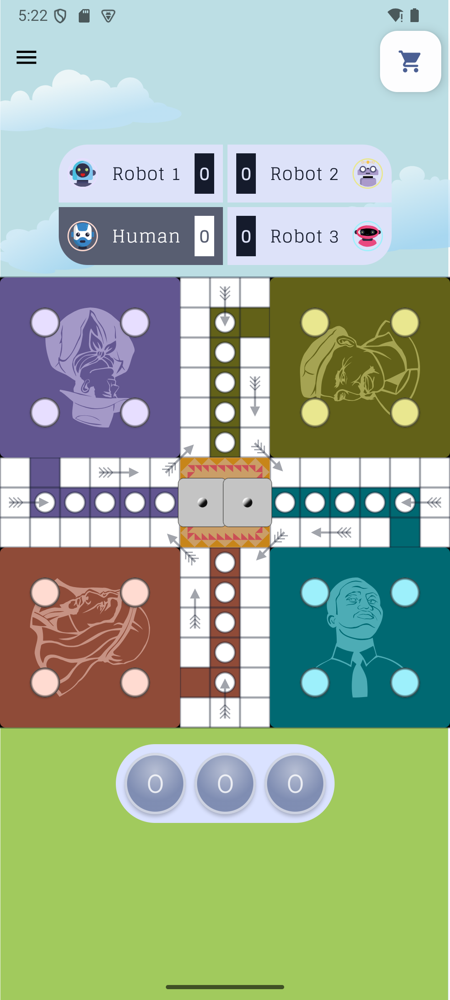
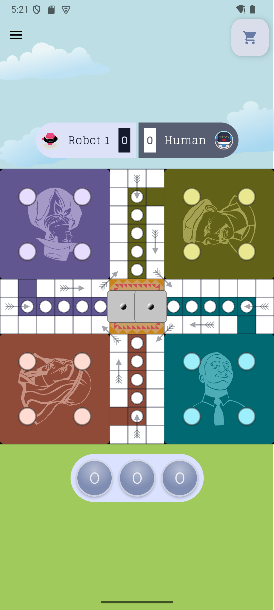
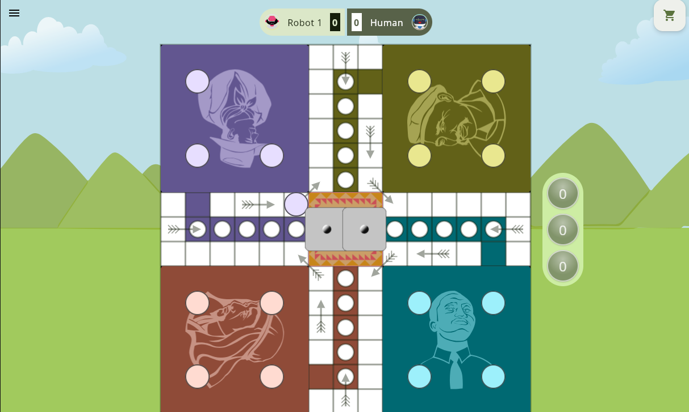
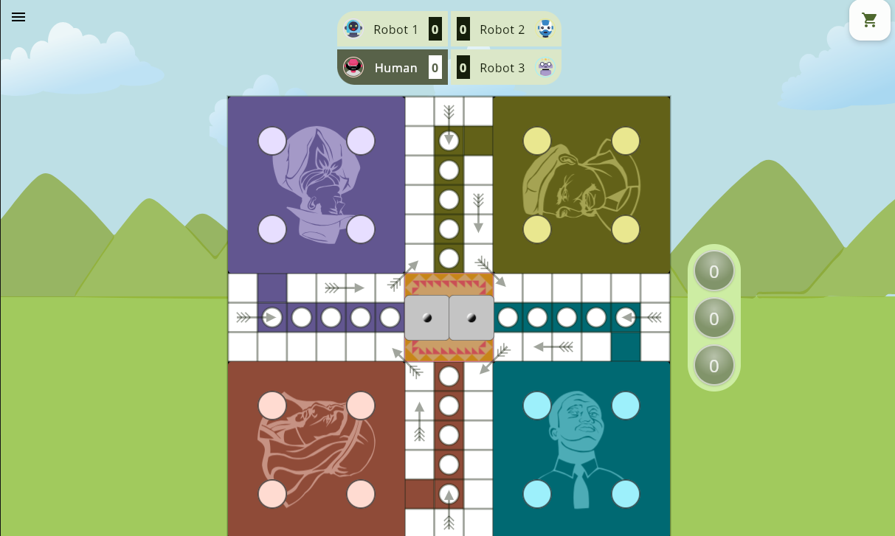
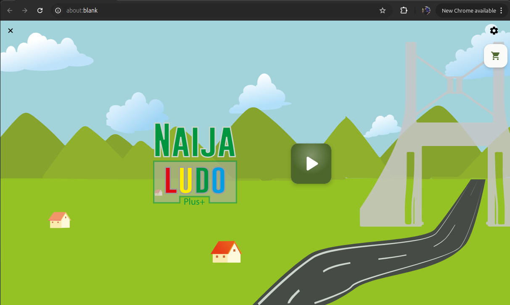
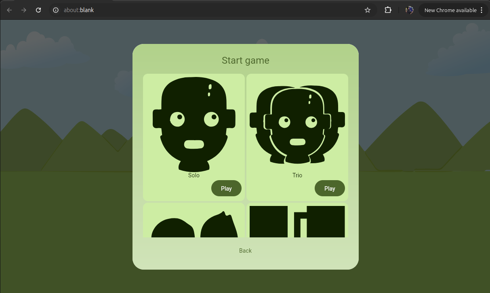
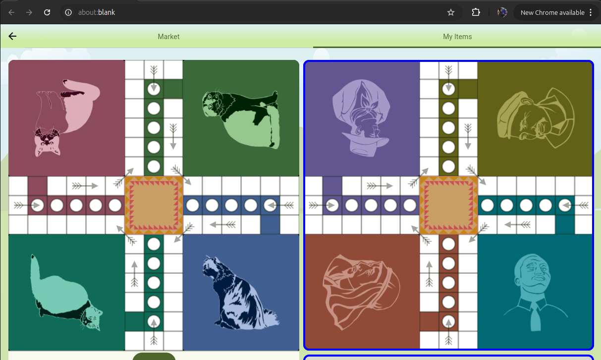

<div align="center">


<p align="center">
 <a>
  
</a>
   
    
  <br>
  <br>
 <a href="">

</a>
    <a href="https://github.com/mshdabiola/hydraulic/actions">
  
  
  
</a>
  <br>
  <a href="https://hits.sh/github.com/mshdabiola/hydraulic/">
      </a>
  <a href="https://github.com/mshdabiola/hydraulic/releases">
      
  </a>
  <a href="https://github.com/mshdabiola/hydraulic/stargazers">
      
  </a>
  <br>
  <a href="https://github.com/mshdabiola/hydraulic/releases/latest">
      
  </a>

[//]: # (   <a href="https://play.google.com/store/apps/details?id=ru.tech.hydraulicshrinker">)

[//]: # (      )

[//]: # (  </a>)

[//]: # (  <a href="https://f-droid.org/packages/ru.tech.hydraulicshrinker">)

[//]: # (      )
</p>


<div align="center">
    <a href="https://play.google.com/store/apps/details?id=ru.tech.hydraulicshrinker"></a>
    <a href="https://f-droid.org/packages/ru.tech.hydraulicshrinker"></a>
    <a href="https://github.com/mshdabiola/hydraulic/releases/latest"></a>
    <a href="https://hydraulic.onrender.com"></a>
    <a href="https://hydraulic-desktop.onrender.com"></a>

</div>

<br>

</div>

<div align="center"> 
     <h1>Hydraulic Compose Multiplatform Template</h1>
</div>

<div style="text-align: center;">
hydraulic is a compose multiplatform template. that use note app as an example. it is multi-module architecture. 
</div>

## Screenshot

### Phone

<p style="text-align: center;">
    
    
    
</p>

### Desktop

<p style="text-align: center;">
    
    
    
</p>

### Web

<p style="text-align: center;">
    
    
    
</p>

## Features

- Dark mode theme
- Change theme

  <summary>Available filters</summary>
  <br>

# Tech stack & Open-source libraries

- Minimum SDK level 21

- [Kotlin](https://kotlinlang.org/) based


- [Dynamic Theme](https://github.com/mshdabiola/DynamicTheme) - library, which allows you to easily
  implement custom color theming.

- [Coroutines](https://github.com/Kotlin/kotlinx.coroutines) for asynchronous work.

- [Flow](https://kotlin.github.io/kotlinx.coroutines/kotlinx-coroutines-core/kotlinx.coroutines.flow/)
  to emit values from data layer reactively.

- [Koin](https://github.com/InsertKoinIO/koin) for dependency injection.

- [Coil](https://github.com/coil-kt/coil) for loading images.

- Jetpack

    - [Compose](https://developer.android.com/jetpack/compose) - Modern Declarative UI style
      framework based on composable functions.

    - [Material You Kit](https://developer.android.com/jetpack/androidx/releases/compose-material3) -
      Material 3 powerful UI components.

    - [Room](https://developer.android.com/jetpack/androidx/releases/room) Constructs Database by providing an abstraction layer over SQLite to allow fluent database access.

    - [Data Store](https://developer.android.com/jetpack/androidx/releases/datastore) - Store data
      asynchronously, consistently, and transactionally.

    - [Lifecycle](https://developer.android.com/jetpack/androidx/releases/lifecycle) - Observe
      Android lifecycles and handle UI states upon the lifecycle changes.
  
- [Turbine](https://github.com/cashapp/turbine) - A small testing library for kotlinx.coroutines Flow.

- [Timber](https://github.com/JakeWharton/timber) - A logger with a small, extensible API.

- [ksp](https://github.com/google/ksp): Kotlin Symbol Processing API.

- Architecture
    - MVVM Architecture (Compose - ViewModel - Model)
    - Repository Pattern
## Build

This project utilizes Kotlin Multiplatform to target Android, Desktop, and WebAssembly (WASM).
Android has two build variants: **GooglePlay** and **FossReliant**. To build and run the project on
each platform, follow the instructions below:

### Android

#### GooglePlay Variant

1. Open the project in Android Studio.
2. Select the **GooglePlay** build variant.
3. Connect an Android device or start an emulator.
4. Run the `app` module. This will build an APK with Google Play dependencies and install it on your
   device or emulator.

#### FossReliant Variant

1. Open the project in Android Studio.
2. Select the **FossReliant** build variant.
3. Connect an Android device or start an emulator.
4. Run the `app` module. This will build an APK without Google Play dependencies, relying on FOSS
   alternatives, and install it on your device or emulator.

### Desktop

Run the following command to build the desktop application:

```bash
./gradlew app:run
```

This will run an executable file on your operating system (Windows, macOS, or Linux).

### Web

Run the following command to build the web application:

```bash
./gradlew wasmJsBrowserRun -t
```

This will start a development server that serves the web application. Open the provided URL in your
browser to access the application.

**Note:** You may need to install Node.js and Yarn for the web build to work correctly.

## Release

This project offers releases for Android, Desktop, and Web. Below are instructions for releasing the
application on each platform.

### Android

#### GooglePlay Variant

To release the GooglePlay variant, follow these steps:

Build the release APK using the following Gradle command:

```bash
./gradlew assembleGooglePlayRelease
```

Upload the signed APK to the Google Play Console.

#### FossReliant Variant

To release the FossReliant variant, follow these steps:

Build the release APK using the following Gradle command:

```bash
./gradlew assembleFossReliantRelease
```

Distribute the APK through your preferred channels (e.g., GitHub Releases, F-Droid).

### Desktop

This project leverages Hydraulic Conveyor for packaging and distributing the Desktop application.
Hydraulic Conveyor simplifies the creation of installers and distributable packages across various
operating systems (Windows, macOS, Linux).

1. Install hydraulic conveyor at [Hydraulic](https://downloads.hydraulic.dev/)

2. Build the release executable using the following Gradle command:

```bash
conveyor make app
```

3. To create site for the all desktop platform

```bash
conveyor make site
```

### Web

To release the Web application, follow these steps:

Build the release version of the web application using the following Gradle command:

```bash
./gradlew wasmJsBrowserDistribution
```

Deploy the built files to your web server or hosting provider.

## Testing

### JVM Tests

This project includes a comprehensive suite of JVM tests to ensure the correctness and reliability
of the core logic and functionality. These tests are written using JvmTest and cover various aspects
of the application, including:

* **Unit tests:** Verify the behavior of individual components and functions in isolation.
* **Integration tests:** Test the interaction between different modules or components of the system.
* **Data layer tests:** Validate data access, persistence, and retrieval operations.
* **Business logic tests:**  Ensure the correct implementation of business rules and workflows.

**Running Tests**

To run the JVM tests, you can use the following Gradle command:

```bash
./gradlew jvmTest
```

### Screenshot Test

Compose Screenshot Testing is an essential part of ensuring UI quality. A screenshot test captures
an image of a Composable function or a section of your app's UI and compares it to a previously
saved reference image, known as a "golden" or "baseline" image. This ensures that UI changes don't
unintentionally introduce visual regressions.

**Compose ScreenshotTest and Gradle Tasks**

Compose screenshot testing can be seamlessly integrated with the Paparazzi library, providing
automated image comparisons. Paparazzi offers the following useful Gradle tasks:

- `validateFossReliantDebugScreenshotTest`: Executes all screenshot tests, comparing captured images
  with the baseline images. This process helps detect any visual discrepancies introduced by code
  changes.
- `updateFossReliantDebugScreenshotTest`: Generates new baseline images. Use this command after
  intentionally modifying the UI and manually verifying the correctness of the new visuals. The
  newly captured screenshots then become the new baseline for future comparisons.
- `testFossReliantDebugScreenshotTest`: Creates comparison images highlighting the differences
  between failed tests and the baseline images. These images aid in pinpointing visual
  discrepancies, simplifying debugging efforts.

## Performance

### Benchmarks

We utilize benchmarking tools to measure the performance of key operations in our application. This
helps identify potential bottlenecks and areas for optimization. Benchmarks are focused on critical
aspects, such as UI rendering, data processing, and network operations, ensuring a smooth and
responsive user experience.

### Baseline Profile

Baseline Profiles are integrated into our build process to enhance app startup time and reduce
initial rendering latency. These profiles provide guidance to the Android Runtime (ART) for
pre-compiling frequently used code paths, leading to faster loading times and improved overall
performance.


```bash
./gradlew generateReleaseBaselineProfile
```

### Compose Compiler Metrics

We leverage Compose Compiler Metrics to monitor and analyze the performance of our Compose UI.
Metrics like recomposition counts and skippability rates help identify potential areas for
optimization and ensure efficient UI rendering. This proactive approach ensures that our Compose UI
remains performant and responsive as the application evolves.


```bash
./gradlew assembleDebug -PenableComposeCompilerMetrics=true -PenableComposeCompilerReports=true
```

## Find this repository useful?

Support it by joining **[stargazers](https://github.com/mshdabiola/hydraulic/stargazers)** for this
repository. :star: <br>
And **[follow](https://github.com/mshdabiola)** me for my next creations! 🤩

## Star History

<div align="center">
<a href="https://star-history.com/#mshdabiola/hydraulic&Date">
  <picture>
    <source media="(prefers-color-scheme: dark)" srcset="https://api.star-history.com/svg?repos=mshdabiola/hydraulic&type=Date&theme=dark" />
    <source media="(prefers-color-scheme: light)" srcset="https://api.star-history.com/svg?repos=mshdabiola/hydraulic&type=Date" />
    
  </picture>
</a>


</div>

## Contributors

<a href="https://github.com/mshdabiola/hydraulic/graphs/contributors">
  
</a>


# License

**Hydraulic** is distributed under the terms of the GNU License (Version 2.0). See the
[license](LICENSE) for more information.
